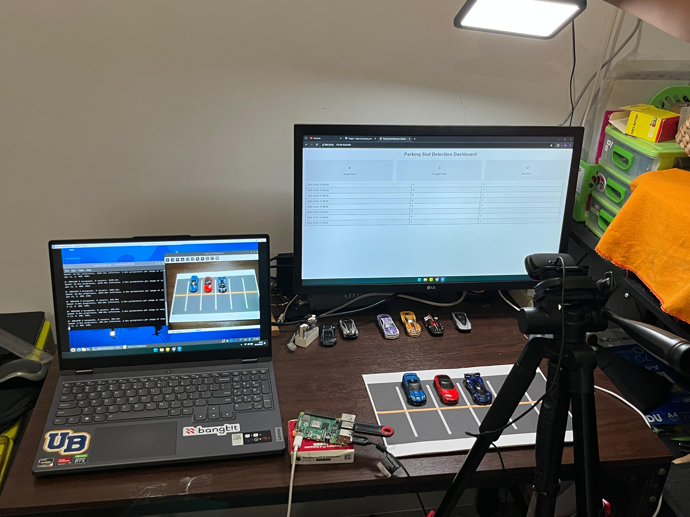

# Sistem Deteksi Slot Parkir Mobil dengan YOLOv5 Berbasis Raspberry Pi 4
**Project akhir mata kuliah Edge Intelligence and Computing - B**

## Anggota Kelompok : ##
- **Virandy Bagaskara Syahwanto** - *215150307111028*
- **Rafi Athallah Kurniawan** - *215150307111030*
- **Ariajuna Yodyatara** - *215150301111025*
- **Yusril Ihza Ariyono** - *215150301111030*
- **Wafdannur Ramadhan** - *215150307111024*

## Project Domain
Proyek berfokus pada sistem deteksi slot parkir pintar yang menggunakan YOLOv5 untuk deteksi objek secara real-time. Sistem ini mendeteksi slot parkir yang kosong dan terisi dari video langsung, mencatat hasilnya, dan menampilkan data melalui dashboard web.

## Dasar Masalah
- Kurangnya informasi real-time slot parkir.
- Efisiensi pengelolaan parkir rendah.
- Keterbatasan sumber daya manusia.

## Solusi
- Menyediakan informasi real-time mengenai ketersediaan slot parkir.
- Memberikan kemudahan untuk pengelolaan sistem parkir.
- Implementasi AI untuk membantu pengelolaan parkir.

## Dataset
Untuk project ini, kami menggunakan dataset "Parking Space Computer Vision Project" yang terdapat pada website Roboflow.

Source : (https://universe.roboflow.com/muhammad-syihab-bdynf/parking-space-ipm1b)

## Source Code Training dan Inferensi
Berikut merupakan kode training dan inferensi murni dengan model YOLOv5 :

- Training : [Source Code Training](training-and-inference/Edge_YOLOv5_Model_Slot_Parking-Training.ipynb)

- Inferensi Murni dengan YOLOv5 : [Source Code Inferensi Murni YOLOv5](training-and-inference/inference.py)

## Prasyarat
### Struktur Direktori Proyek

### Persiapan Komponen
- **Raspberry Pi 4** : Edge device untuk proses deteksi slot parkir secara real-time.
- **Webcam** : Input video real-time untuk deteksi slot parkir. 
- **Power Adaptor** : Sumber daya sistem.
- **Tripod** : Menopang dan menstabilkan posisi webcam (Posisi yang stabil direkomendasikan agar inferensi berjalan dengan baik dan stabil)
- **Koneksi Internet** : Pastikan Raspberry Pi dan perangkat lain terhubung dalam satu jaringan yang sama.

### Persiapan Perangkat Lunak
- **Raspberry Pi OS** : Sistem operasi Raspberry Pi
- **Python 3.8 atau lebih baru** 
- **Flask Library** : Framework web untuk dashboard.
- **Flask-SocketIO Library** : Integrasi WebSocket untuk update data secara real-time.
- **OpenCV Library** : Menangkap video dari webcam dan menampilkan frame.
- **Ultralytics Library** : Menjalankan model YOLO.
- **Model YOLOv5 (You Only Look Once v5)**
- **CSV** : Mencatat log parkir.

Untuk menginstall library yang digunakan pada sistem, jalankan perintah :

`pip install -r requirements.txt`

## Arsitektur Umum

## Tampilan Umum Sistem

## Flowchart Sistem

**Alur Kerja Sistem** :

1. Sistem dimulai dengan mengaktifkan beberapa komponen penting, seperti Flask untuk server backend, SocketIO untuk mengirim data real-time ke dashboard, dan YOLO untuk mendeteksi kendaraan.

2. Setelah semuanya siap, webcam dinyalakan untuk mulai menangkap gambar atau video secara langsung.

3. Sistem kemudian mengambil gambar (frame) dari webcam dan mengirimkannya ke YOLO untuk dianalisis. Di sini, YOLO akan mendeteksi kendaraan yang ada di frame tersebut, seperti mobil atau motor.

4. Setelah kendaraan terdeteksi, sistem akan menghitung jumlah slot parkir yang kosong dan terisi sesuai dengan jenis kendaraan yang ditemukan.

5. Data hasil deteksi ini disimpan ke dalam file CSV sebagai catatan, sehingga semua aktivitas sistem terdokumentasi dengan baik.

6. Pada saat yang sama, sistem juga mengirim data real-time ke dashboard agar pengguna bisa langsung melihat informasi jumlah slot parkir yang tersedia.

7. Setelah selesai memproses sebuah gambar, sistem akan masuk ke mode istirahat (idle) selama 2 detik. Ini seperti jeda singkat sebelum sistem kembali bekerja, supaya penggunaan komputasi lebih efisien.

8. Selama mode istirahat, sistem akan memeriksa dua hal:

    - Apakah waktu 2 detik sudah selesai? Kalau iya, sistem akan melanjutkan untuk memproses gambar berikutnya.
    - Apakah pengguna ingin mematikan sistem? Kalau iya, sistem akan berhenti bekerja.

9. Kalau tidak ada perintah untuk mematikan sistem, maka sistem akan terus mengulangi proses ini dari awal: menangkap gambar, mendeteksi kendaraan, menghitung slot parkir, menyimpan data, dan mengirim ke dashboard.

10. Sistem akan benar-benar berhenti hanya jika pengguna memutuskan untuk mematikannya.

## Tampilan Dashboard

## Setup dan Demo
### Setup
- Hubungkan webcam ke Raspberry Pi.
- Hidupkan Raspberry Pi yang sudah diinstall dengan Raspberry OS.
- Pastikan Raspberry Pi terhubung dengan jaringan internet.
- Jika belum menginstall Python 3 dan pip pada Raspberry Pi, maka jalankan perintah :

`sudo apt update` 

`sudo apt install python3 python3-pip`

- Lalu, install git untuk melakukan clone repository :

`sudo apt install git`

- Lakukan clone repository, jalankan perintah :

`git clone https://github.com/randybagaskr25/parking-slot-detection-edge-b.git`

`cd parking-slot-detection-edge-b`

- Install depedensi yang tercantum pada requirements.txt :

`pip install -r requirements.txt`

- Setelah memastikan semua telah terhubung dan terinstall, selanjutnya jalankan app.py :

`python app.py`

- Setelah menjalankan app.py, akses web dashboard dengam alamat yang muncul pada terminal.

Contoh :

`http://127.0.0.1:5000`

atau

`http://172.20.10.6:5000`

- Jika ingin keluar dari program, tekan CTRL + C.

### Demo

Berikut merupakan video demo sistem :

[Klik di sini untuk menonton video demo](https://youtu.be/KHmaRmlyLBo)

## Kesimpulan
Proyek ini berhasil menciptakan sistem deteksi slot parkir real-time yang menggunakan model YOLOv5, dihubungkan dengan aplikasi web berbasis Flask dan SocketIO untuk menampilkan informasi jumlah slot kosong dan terisi secara langsung ke dashboard web. Selain itu, sistem ini mencatat hasil deteksi dalam file log CSV untuk analisis lebih lanjut. Meskipun deteksi dilakukan dengan cepat dan akurat, tantangan tetap ada pada kualitas gambar dan akurasi dalam kondisi lingkungan yang bervariasi.
